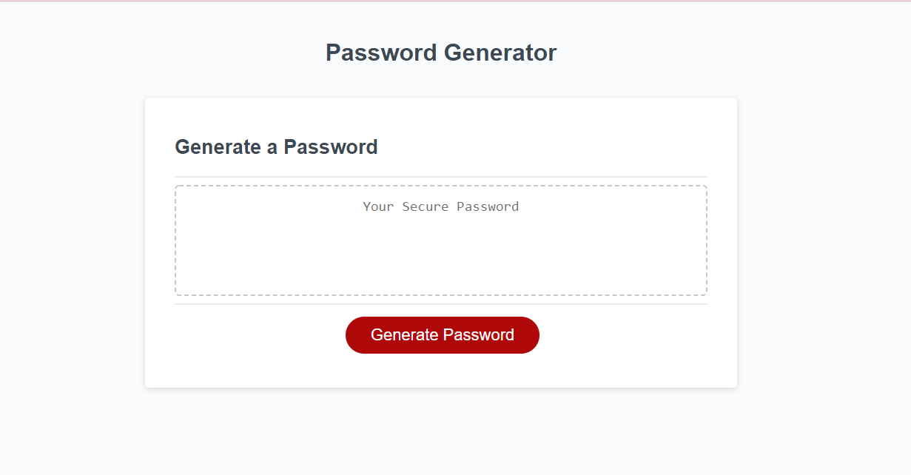
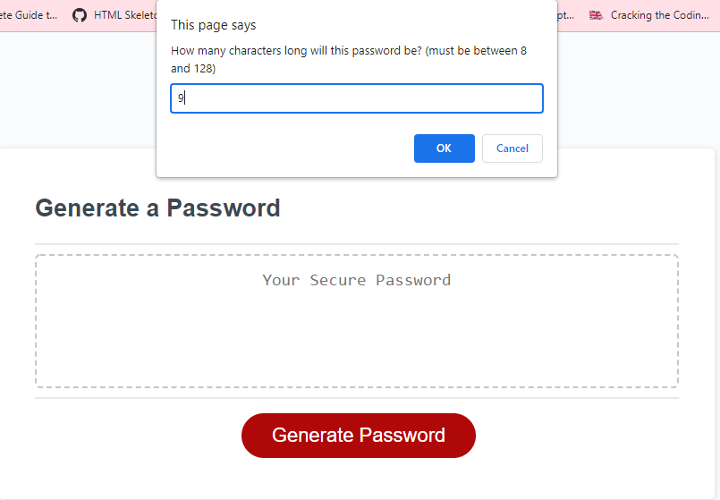
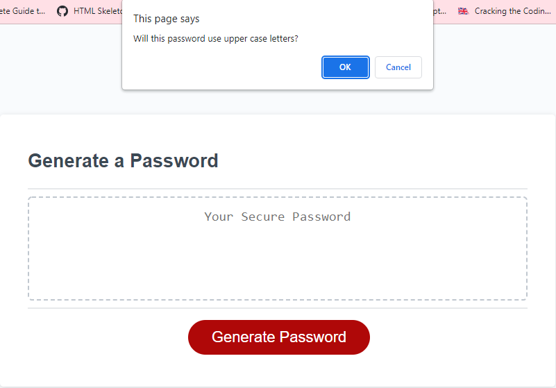
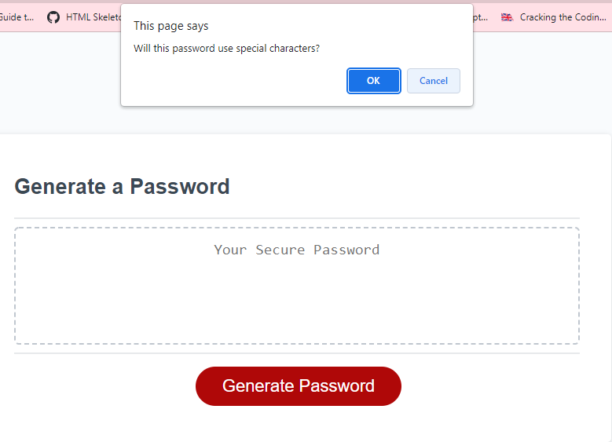
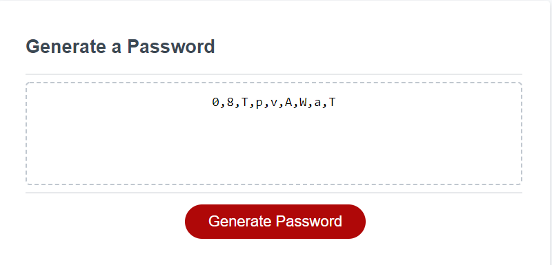

# password-generator

***This is the html and css webpage that I started with to create this generator

The first prompt you see after hitting the button asks how many characters long your password will be.

These two images show the prompts asked after giving the password length. The user said 'confirm' for thr first one and 'cancel for the second.

This is the final result of the prompts. It is 9 characters long, includes uppercase letters, lowercase letters, numbers, and no special characters.

This project was made by Matt Gibson

Email: matthewryangibson99@gmail.com

github link:
https://github.com/matt0999/week-3-password-generator